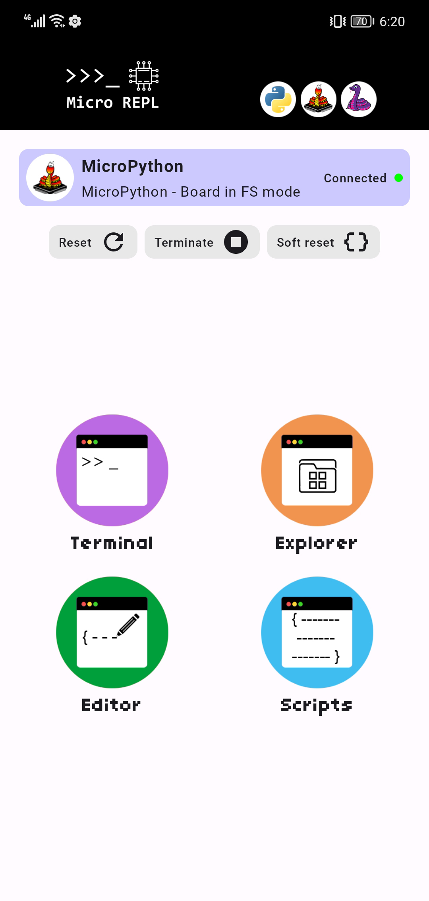
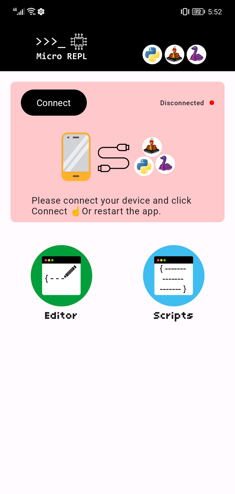
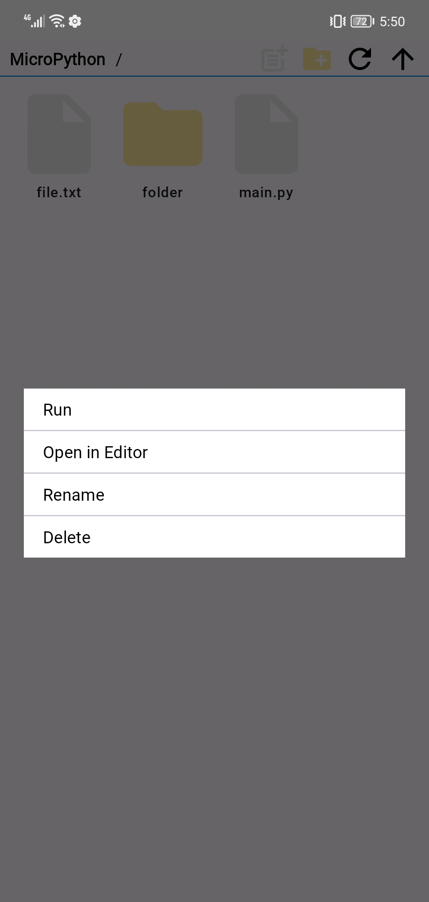
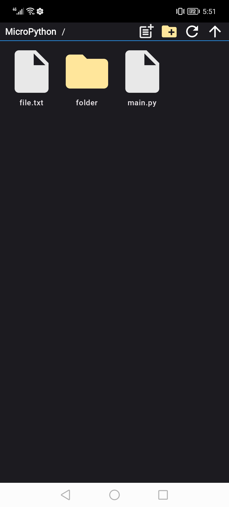
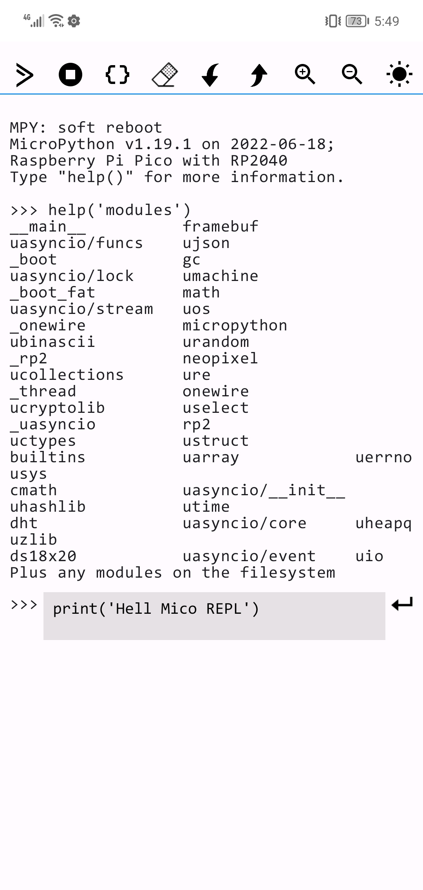
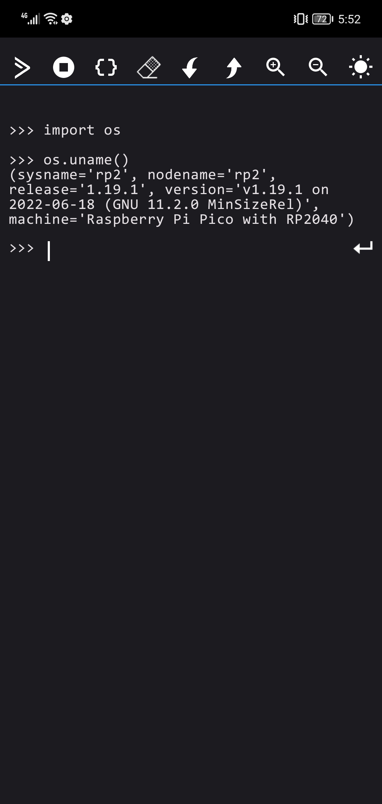
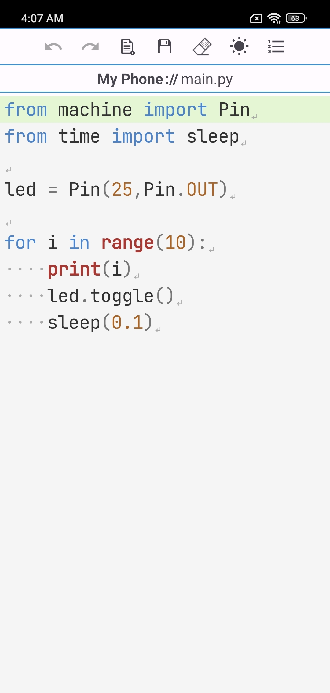

# [Micro REPL](https://play.google.com/store/apps/details?id=micro.repl.ma7moud3ly)
#### MicroPython & <del>CircuitPython</del> IDE for Android. 
#### Download from [Google Play](https://play.google.com/store/apps/details?id=micro.repl.ma7moud3ly)
> **Note** Currently MicroPython is only supported.

## Micro REPL has the following features:
- A **Terminal** to access MicroPython interactive interpreter.
- An **Explorer** (Files Manager) for MicroPython storage.
- A basic **Code Editor**

## Requirments
- Smartphone with Android 7+ and supports [USB_On-The-Go](https://en.wikipedia.org/wiki/USB_On-The-Go).
- Microcontroller flashed with [MicroPython](https://micropython.org/download/) firmware 
> **Note** This version tested with Raspberry Pi Pico & MicroPython v1.19.1  [p2-pico-20220618-v1.19.1.uf2](https://micropython.org/download/rp2-pico/)

## Screenshots:
### >>> Homescreen

&nbsp;&nbsp;&nbsp;

 

### >>> Files Manager

&nbsp;&nbsp;&nbsp;

 

### >>> Terminal

&nbsp;&nbsp;&nbsp;

 

### >>> Code Editor

&nbsp;&nbsp;&nbsp;

### References
- https://docs.micropython.org/en/latest/esp8266/tutorial/repl.html
- https://docs.micropython.org/en/latest/library/machine.html

### Inspired by
- https://github.com/thonny/thonny
- https://github.com/dhylands/rshell
- https://github.com/mik3y/usb-serial-for-android
