

# `>>>` Micro REPL

### A MicroPython IDE for Android

Plug a microcontroller into your phone over USB and get a real REPL,
a file manager, and a code editor. No laptop required.

Or check the [Releases](https://github.com/Ma7moud3ly/micro-repl/releases/latest).

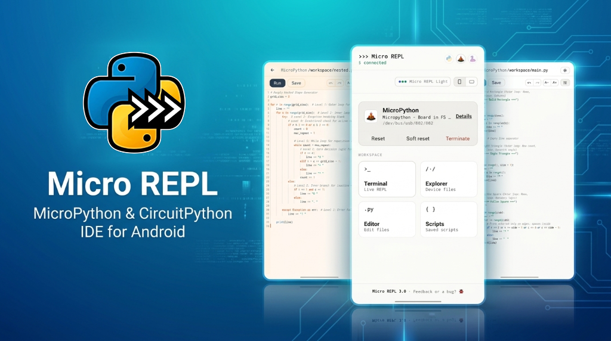

## What it does

**Terminal**: a live MicroPython prompt. Run code, reset the board, or stop a
script that's stuck in a loop.

**Files Explorer**: browse the board's storage. Create, rename, delete and share
files, or import them from your phone.

**Code Editor**: syntax highlighting, autocomplete and undo/redo. Save to the
board or your phone.

**Scripts**: keep your own scripts on the phone, and edit them with no board
connected.

**Themes**: 20+ themes that colour the whole app, not just the code.

## What you need

- Android 6.0 or newer, with [USB On-The-Go](https://en.wikipedia.org/wiki/USB_On-The-Go) support
- A board flashed with [MicroPython](https://micropython.org/download/)

Tested on [Raspberry Pi Pico](https://micropython.org/download/RPI_PICO) and
[ESP32](https://micropython.org/download/ESP32_GENERIC).

> CircuitPython boards are not supported yet.

## Screenshots

### Pick a theme, the whole app follows

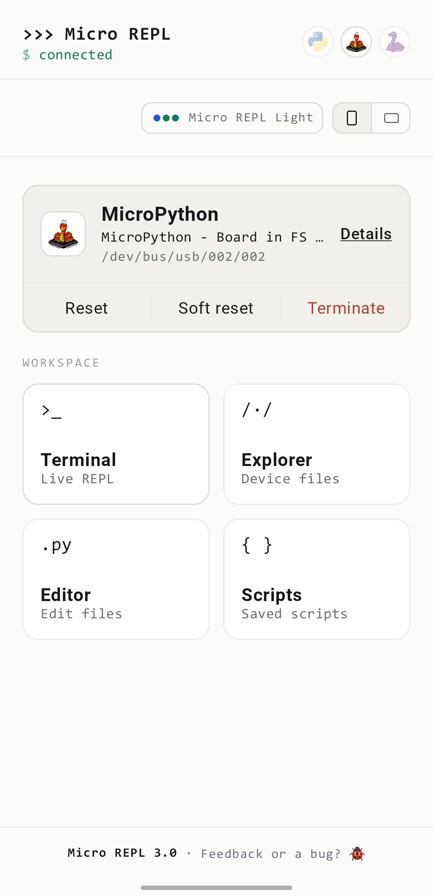
&nbsp;
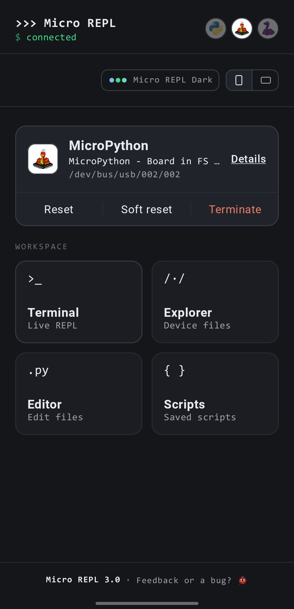
&nbsp;
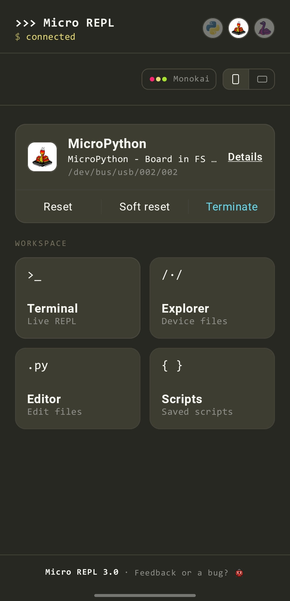
&nbsp;
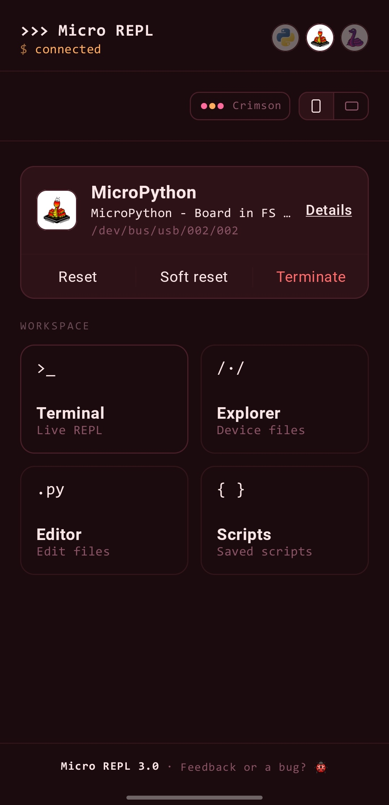

### Terminal

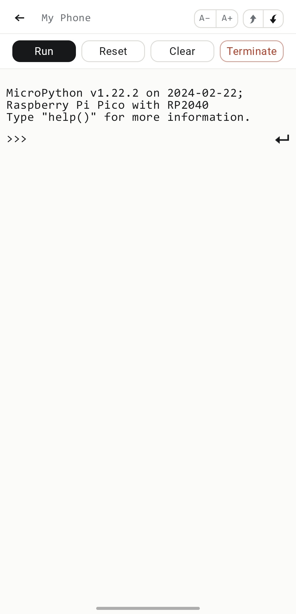
&nbsp;&nbsp;
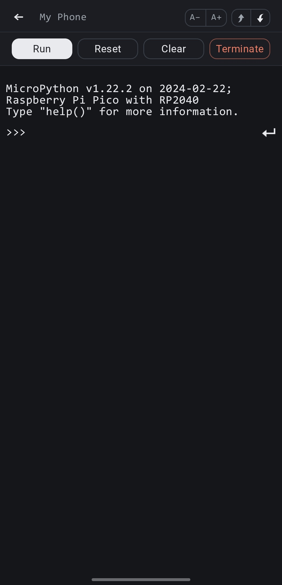

### Files Explorer

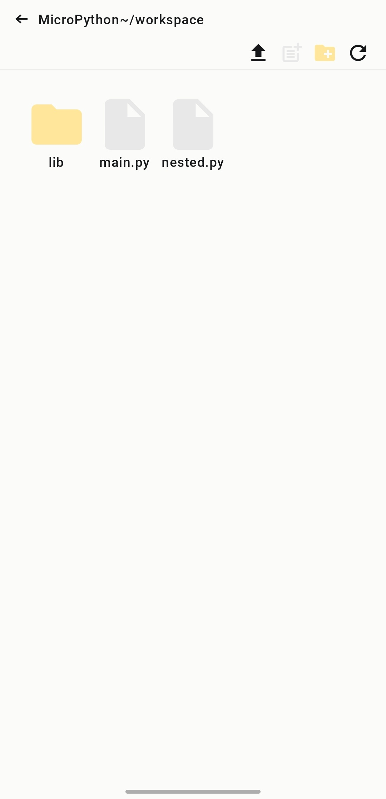
&nbsp;&nbsp;
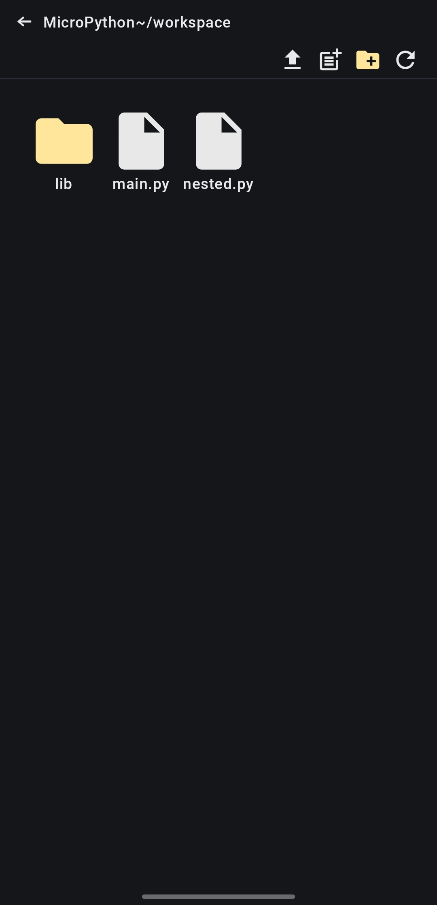

### Code Editor

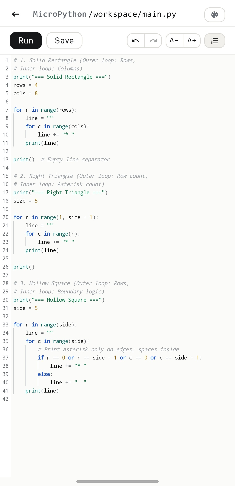
&nbsp;&nbsp;
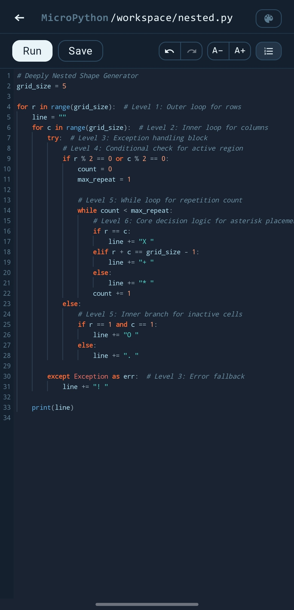

Run a script and see its output right away:

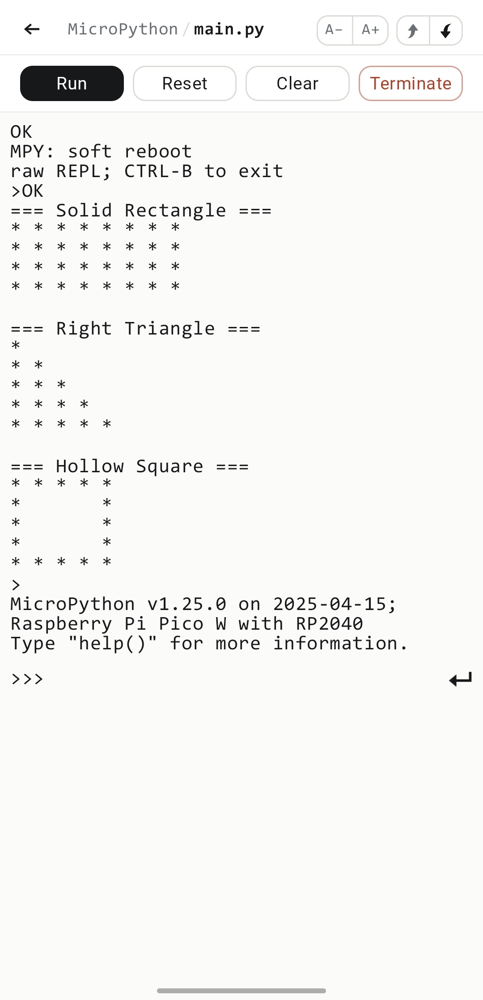
&nbsp;&nbsp;
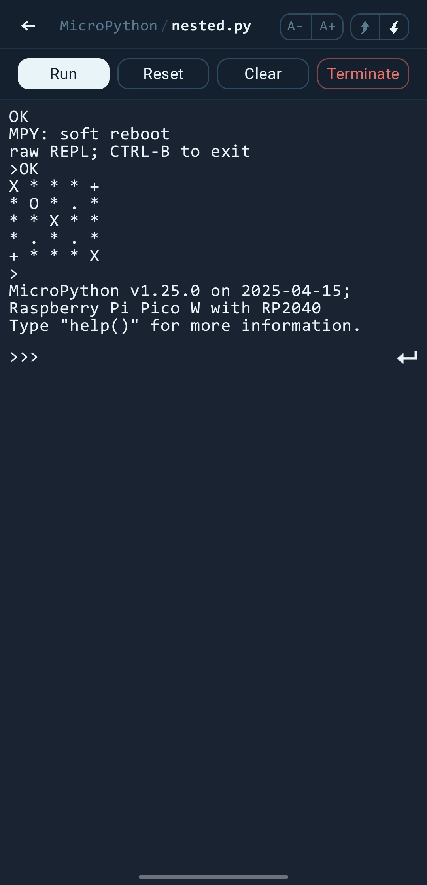

## Built with

- [nemo-editor](https://github.com/Ma7moud3ly/nemo-editor): the Compose code editor
- [usb-serial-for-android](https://github.com/mik3y/usb-serial-for-android): serial communication

## References

- [MicroPython REPL](https://docs.micropython.org/en/latest/esp8266/tutorial/repl.html)
- [MicroPython machine module](https://docs.micropython.org/en/latest/library/machine.html)

