<div align="center">

# `>>>` Micro REPL

### A MicroPython IDE for Android, Desktop and the Web

Plug a microcontroller in over USB and get a live REPL, a file explorer and a
code editor, on your phone, your computer or right in the browser.


[](https://github.com/Ma7moud3ly/micro-repl/releases/latest)
[](#android)
[](#desktop)
[](https://kotlinlang.org/docs/multiplatform.html)
[](https://micropython.org)
[](LICENSE.txt)

[](https://play.google.com/store/apps/details?id=micro.repl.ma7moud3ly)
[](https://f-droid.org/packages/micro.repl.ma7moud3ly/)

**[Open the web version](https://ma7moud3ly.github.io/micro-repl)** ·
**[Desktop downloads](https://github.com/Ma7moud3ly/micro-repl/releases/latest)**

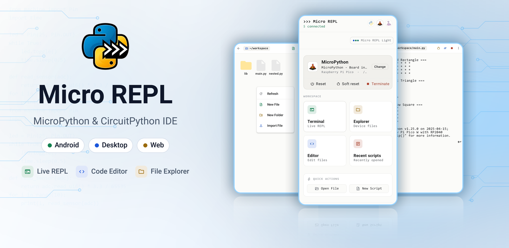

</div>

## What it does

**Terminal**: a live MicroPython prompt. Run code, step through your command
history, soft reset the board, or stop a script that's stuck in a loop.

**Explorer**: browse the board's storage. Create, rename, delete and run files,
or import them from your device.

**Editor**: syntax highlighting, undo and redo, and keyboard shortcuts on
desktop. Run a script on the board in one tap, and save it to the board or to
any folder on your device.

**Recent scripts**: files you opened or saved come back in one tap, even after
a restart.

**Themes**: 20+ themes that color the whole app, not just the code.

**One app, three platforms**: the same app and the same layout on Android,
Windows, macOS, Linux and the browser, adapting to phones, tablets and wide
desktop windows.

## What you need

- A board flashed with [MicroPython](https://micropython.org/download/), and a USB cable
- One of:
  - **Android** 7.0 or newer, with [USB On-The-Go](https://en.wikipedia.org/wiki/USB_On-The-Go) support
  - **Desktop**: Windows, macOS or Linux
  - **Web**: a browser with [Web Serial](https://developer.mozilla.org/docs/Web/API/Web_Serial_API), such as Chrome, Edge or Opera on desktop

## Tested on

- **Boards:** [Raspberry Pi Pico](https://micropython.org/download/RPI_PICO),
  [Pico W](https://micropython.org/download/RPI_PICO_W) and
  [ESP32](https://micropython.org/download/ESP32_GENERIC)
- **Platforms:** Android, Windows, Linux and Chrome
---

## Android

<div align="center">
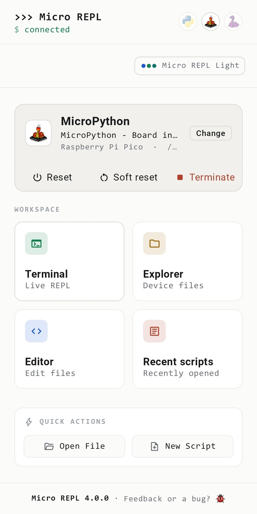
&nbsp;
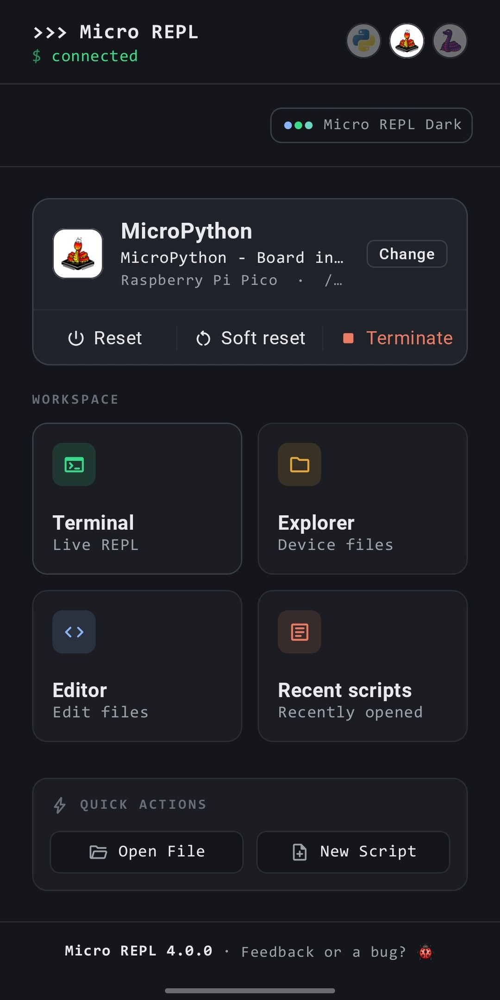
&nbsp;
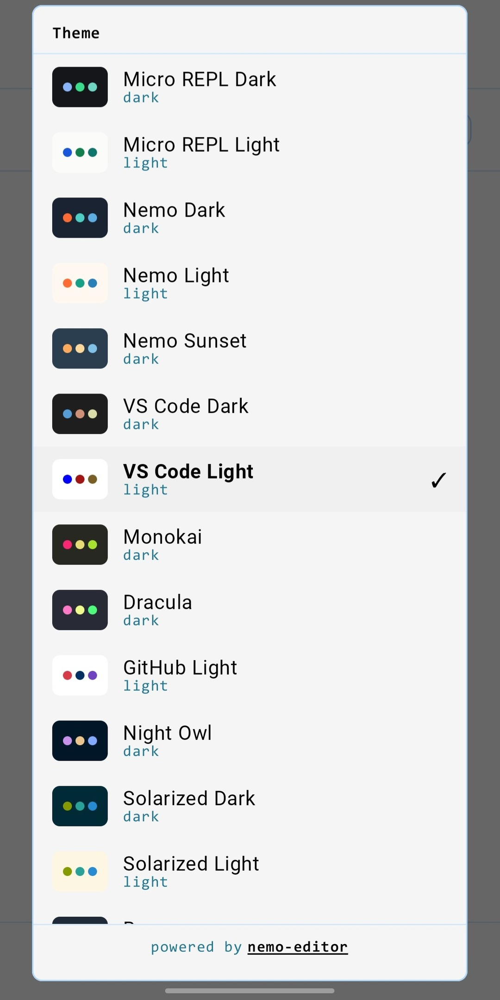
</div>
<br>
<div align="center">
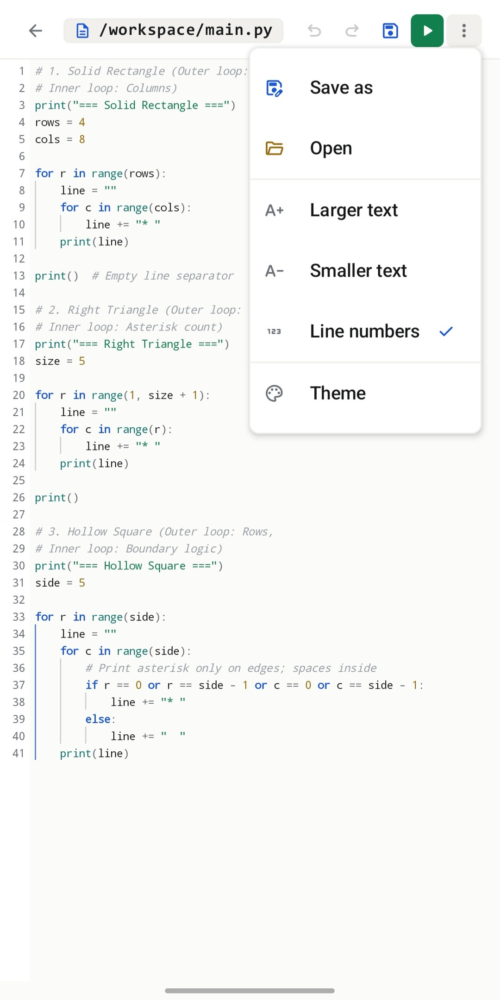
&nbsp;
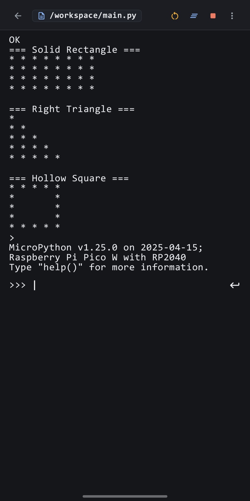
&nbsp;
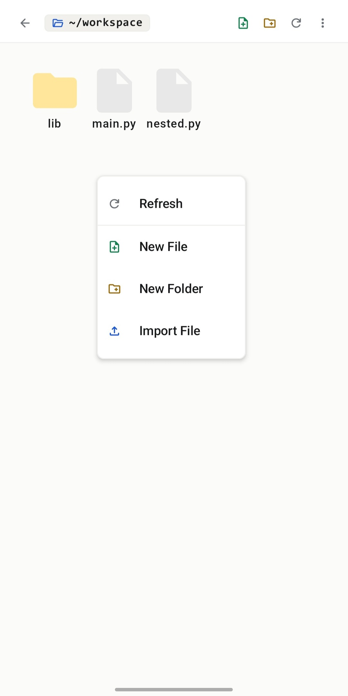
</div>

### Build

The app comes in two flavors: `default` has no analytics, and `gms` adds
Firebase Analytics and Crashlytics.

```bash
# debug build, installed on a connected device
./gradlew :androidApp:installDefaultDebug

# debug APK
./gradlew :androidApp:assembleDefaultDebug

```

The APKs land in `androidApp/build/outputs/apk/`. A release build is signed
when `local.properties` holds the `RELEASE_*` signing keys.

---

## Desktop

<div align="center">
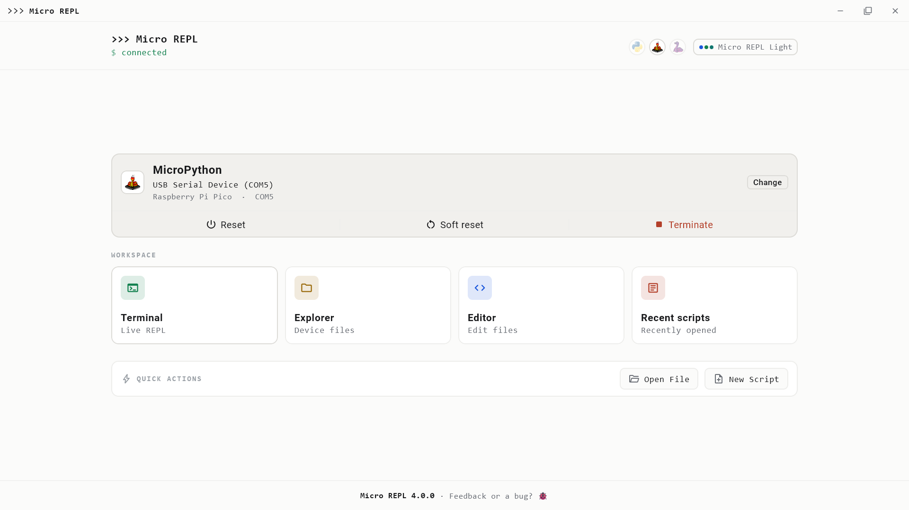
</div>
<br>
<div align="center">
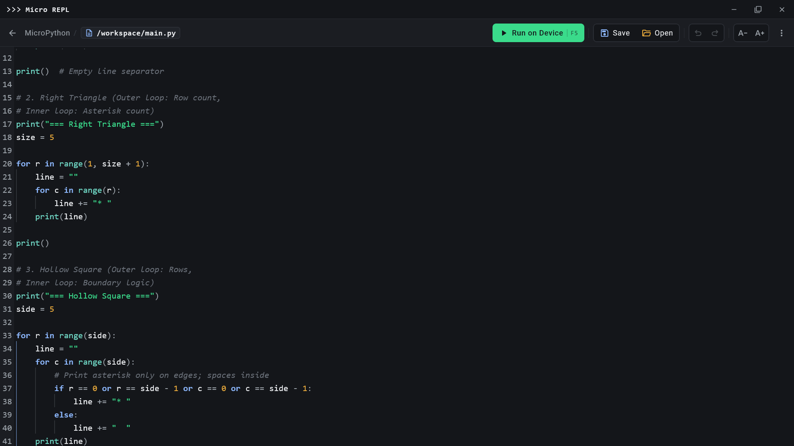
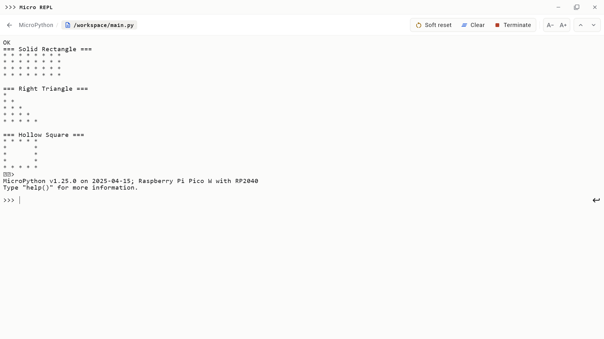
</div>

The desktop app draws its own title bar, follows the theme, and lists every
serial port to connect to. Shortcuts in the editor: <kbd>F5</kbd> runs,
<kbd>Ctrl</kbd>/<kbd>Cmd</kbd> + <kbd>S</kbd> saves, + <kbd>O</kbd> opens and <kbd>N</kbd> starts a new script.

> **Linux:** the first time a port can't be opened, the app asks for your
> permission to install a udev rule that gives every user access to USB serial
> ports.

### Build

```bash
# run from source
./gradlew :desktopApp:run

# installer for the current OS: .msi on Windows, .dmg on macOS, .deb on Linux
./gradlew :desktopApp:packageDistributionForCurrentOS

# a single runnable jar for the current OS
./gradlew :desktopApp:packageUberJarForCurrentOS
```

The packages land in `desktopApp/build/compose/binaries/`, and the jar in
`desktopApp/build/compose/jars/`. Each installer has to be built on its own OS.

---

## Web

<div align="center">
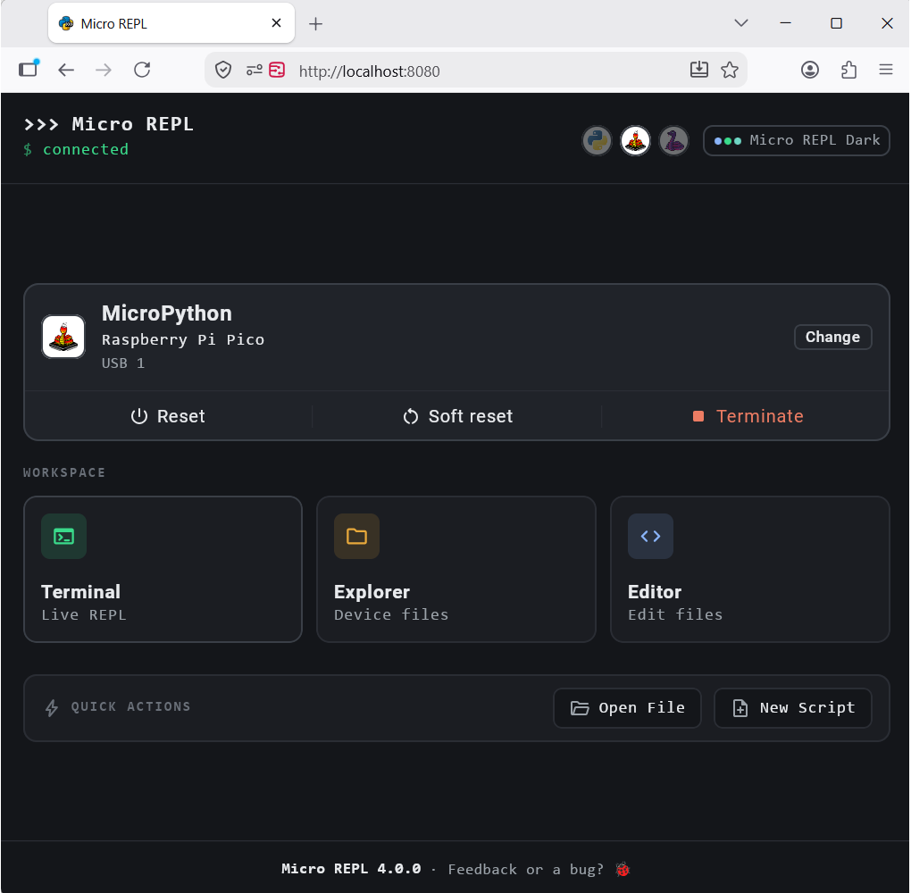
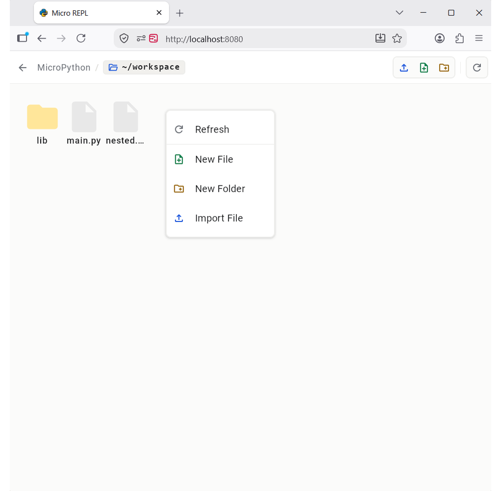
</div>

**[Open the web version](https://ma7moud3ly.github.io/micro-repl)**. Connect
opens the browser's port picker, which lists only boards and USB-serial chips.
Ports you allowed before come back on the next visit.

> Web Serial works in Chrome, Edge and Opera on desktop, over HTTPS or
> `localhost`.

### Build

```bash
# development server at http://localhost:8080
./gradlew :webApp:wasmJsBrowserDevelopmentRun

# production build
./gradlew :webApp:wasmJsBrowserDistribution
```

The production build lands in `webApp/build/dist/wasmJs/productionExecutable/`,
ready to host on any static server.

---

## Built with

- [Kotlin Multiplatform](https://kotlinlang.org/docs/multiplatform.html) and
  [Compose Multiplatform](https://www.jetbrains.com/compose-multiplatform/): one
  codebase for Android, Desktop and Web
- [nemo-editor](https://github.com/Ma7moud3ly/nemo-editor): the Compose code editor
- [usb-serial-for-android](https://github.com/mik3y/usb-serial-for-android): USB serial on Android
- [jSerialComm](https://fazecast.github.io/jSerialComm/): serial ports on Windows, macOS and Linux
- [Web Serial API](https://developer.mozilla.org/docs/Web/API/Web_Serial_API): serial ports in the browser
- [FileKit](https://github.com/vinceglb/FileKit): file pickers on every platform
- [Koin](https://insert-koin.io/): dependency injection
- [Navigation 3](https://developer.android.com/guide/navigation/navigation-3): navigation
- [Material Symbols](https://fonts.google.com/icons): icons

## References

- [MicroPython REPL](https://docs.micropython.org/en/latest/reference/repl.html)
- [MicroPython raw REPL](https://docs.micropython.org/en/latest/reference/mpremote.html)
- [MicroPython machine module](https://docs.micropython.org/en/latest/library/machine.html)
- [Web Serial API](https://developer.mozilla.org/docs/Web/API/Web_Serial_API)

## License

Micro REPL is released under the [MIT License](LICENSE.txt).
