# Micro REPL
#### MicroPython & <del>CircuitPython</del> IDE for Android. 
> **Note** Currently MicroPython is only supported.

Or download the latest APK from the [Releases Section](https://github.com/Ma7moud3ly/micro-repl/releases/latest).

## Micro REPL has the following features:
- A **Terminal** to access MicroPython interactive interpreter.
- Files **Explorer** (Files Manager) for MicroPython storage.
- A Smart **Code Editor** with python syntax support and code completion.

## Requirements
- Smartphone with Android 7+ and supports [USB_On-The-Go](https://en.wikipedia.org/wiki/USB_On-The-Go).
- Microcontroller flashed with [MicroPython](https://micropython.org/download/) firmware 
> **Note** This version tested with MicroPython v1.25.0 & [Raspberry Pi Pico](https://micropython.org/download/RPI_PICO) / [ESP32](https://micropython.org/download/ESP32_GENERIC)

## Screenshots:
### >>> Homescreen

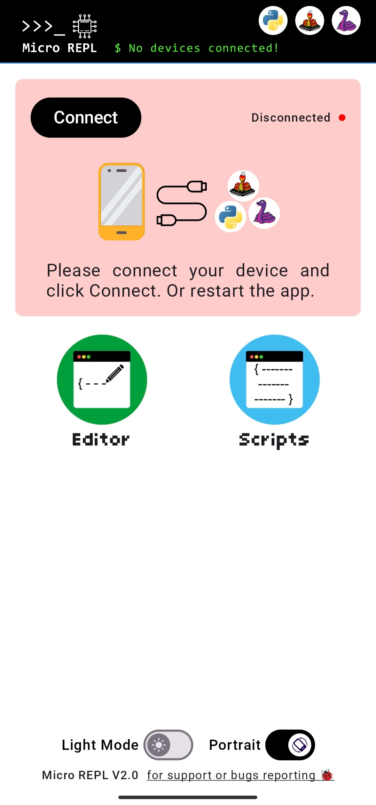
&nbsp;&nbsp;&nbsp;
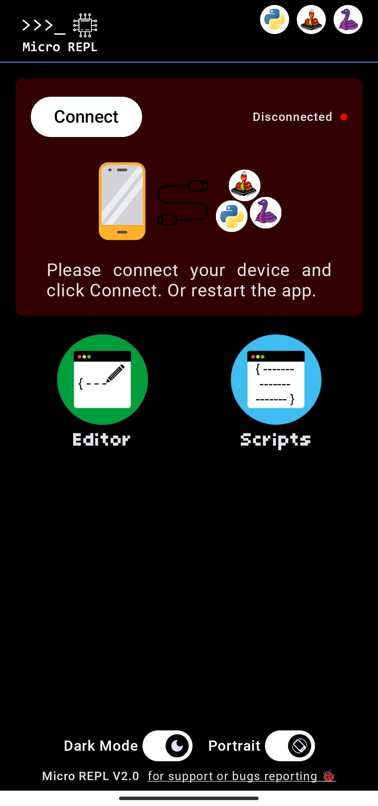

 

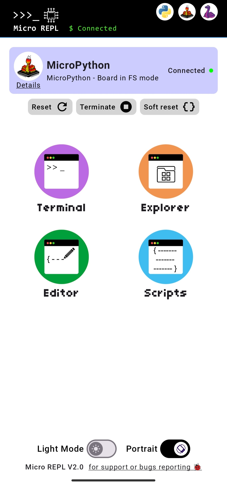
&nbsp;&nbsp;&nbsp;
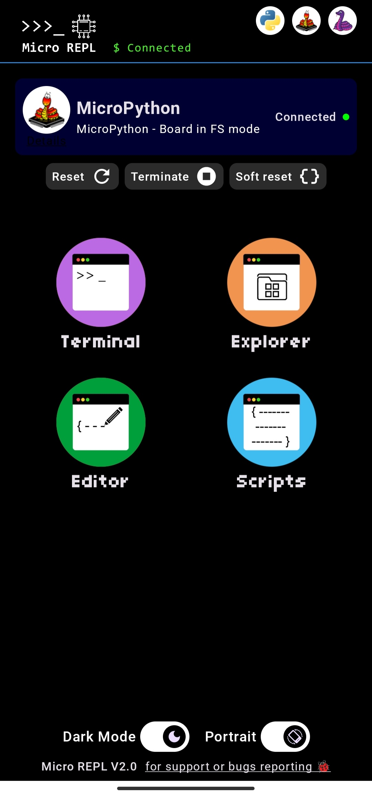

 

### >>> Files Manager

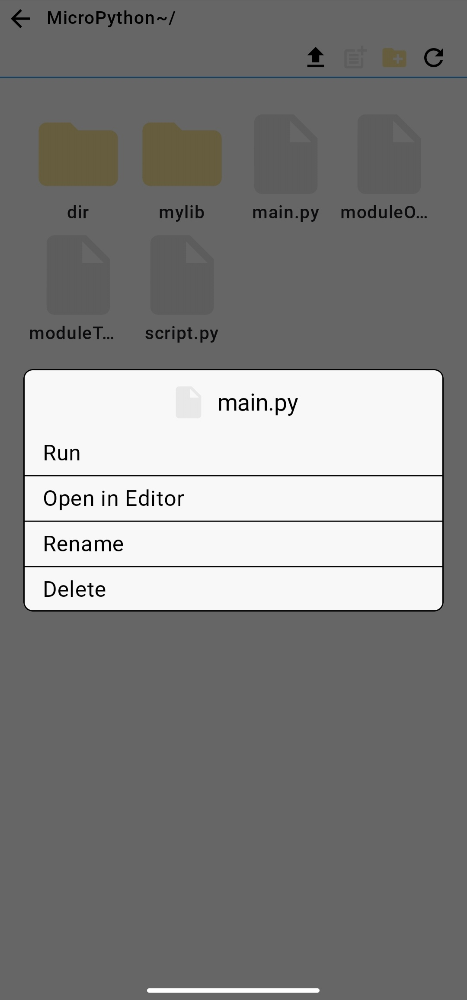
&nbsp;&nbsp;&nbsp;
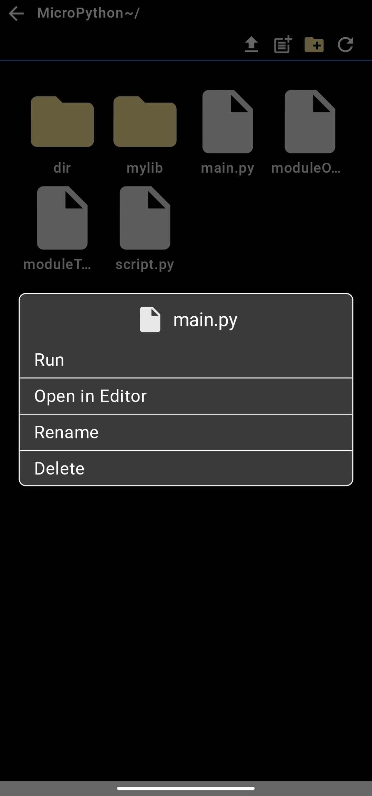

 

### >>> Terminal

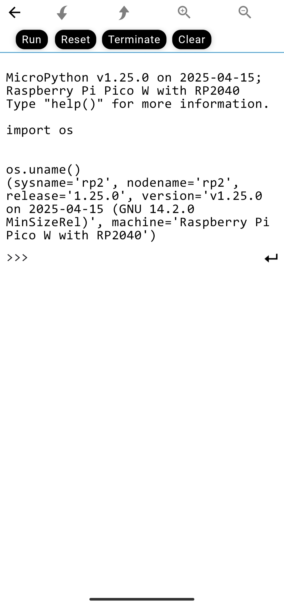
&nbsp;&nbsp;&nbsp;
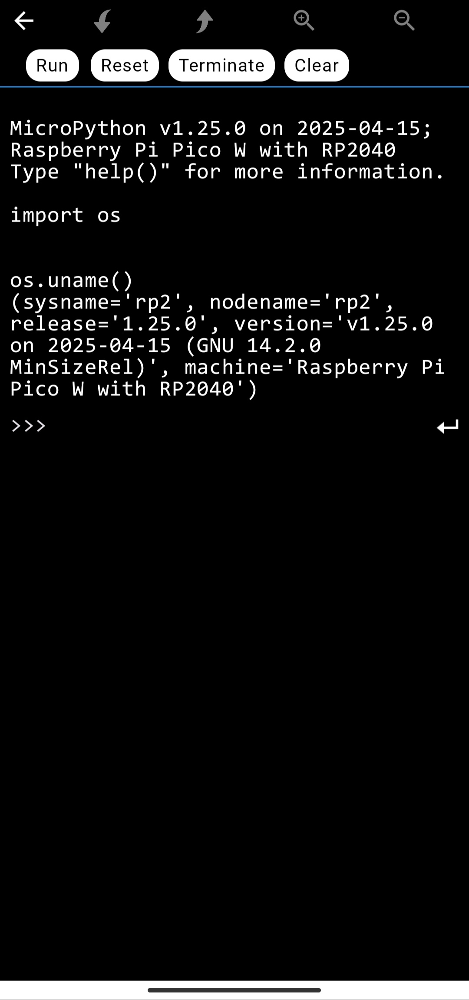

 

### >>> Code Editor

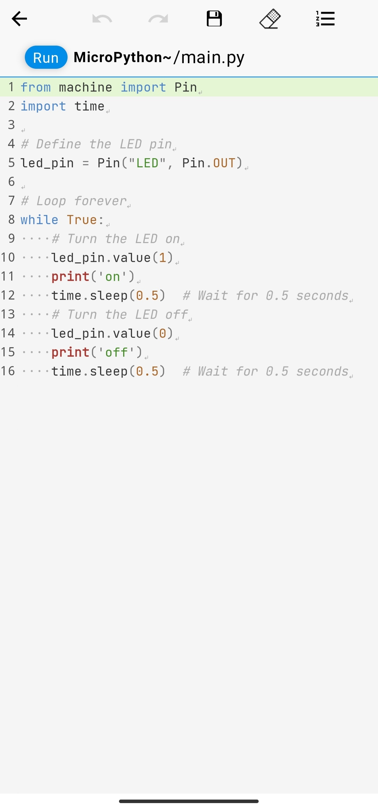
&nbsp;&nbsp;&nbsp;
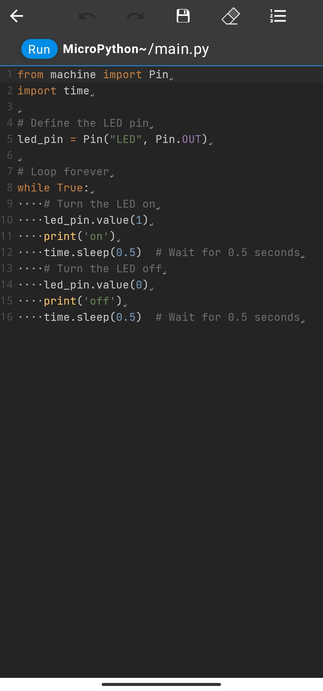

### >>> Local Scripts

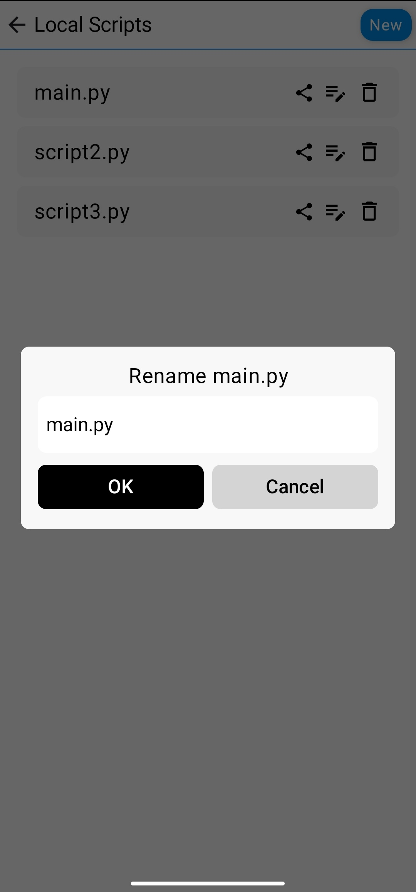
&nbsp;&nbsp;&nbsp;
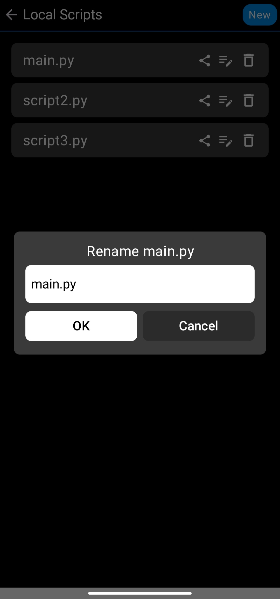

### References
- https://docs.micropython.org/en/latest/esp8266/tutorial/repl.html
- https://docs.micropython.org/en/latest/library/machine.html

### Inspired by
- https://github.com/thonny/thonny
- https://github.com/dhylands/rshell
- https://github.com/mik3y/usb-serial-for-android
- https://github.com/Rosemoe/sora-editor
- https://github.com/PsiCodes/KtxPy/tree/master
